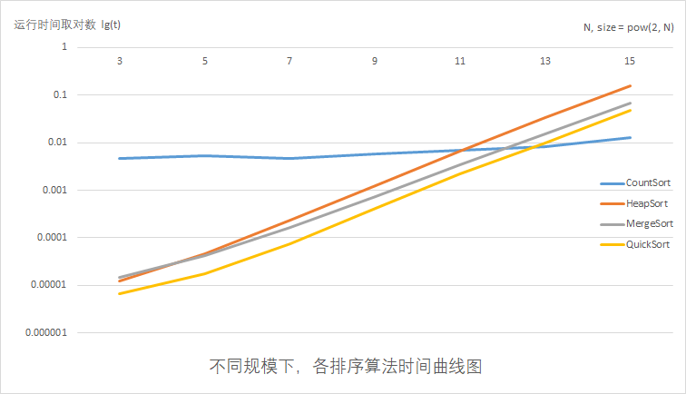

[TOC]

# 算法基础 -- 上机实验1

## 实验内容及要求

###	实验内容

* 使用不同的排序算法，排序n个元素，元素为随机生成的1到65535之间的整数，n = 2^N^, N的取值为： 3，5，7，9，11， 13 ，15 ；
* 算法要求：堆排序，快速排序， 归并排序，计数排序。

### 实验要求

实验格式：

* 实验需建立根文件夹，文件夹名称为：学号-project1，在根文件夹下需包括实验报告、和ex1子文件夹，子文件夹又分别包含3个子文件夹：

  * input文件夹：存放输入数据
  * source文件夹：源程序
  * output文件夹：输出数据

* input:

  * 输入文件中每行一个随机数据，总行数大于等于 2^15^  

  * 顺序读取n个数据，进行排序

  * example：用快速排序对 2^11^ 个元素进行排序，其随机数据的输入文件路径为

     学号-project1/ex1/input/input_strings.txt，顺序读取前2^11^ 个元素进行排序。

* output:

  * 每种算法建立一个子文件夹，其输出结果数据导出到其对应子文件下面

    * result_n.txt：排序结果的数据 (N为数据规模的指数)，每个数据规模一个输出文件
    * time.txt：运行时间效率的数据，六个规模的时间结果都写到同个文件

  * Example：用快速排序对2^11^个元素进行排序，其排序结果文件路径为

    ​     学号-project1/ex1/output/quick_sort/result_11.txt

### 注意事项

* 实验报告中要有必要的实验过程截图和图表；
* 图片要有单位，横纵坐标等信息；
* ex1,ex2目录结构严格按照实验格式的要求；
* 代码中需要有必要的注释；
* 实验杜绝抄袭他人代码或者实验结果，如发现代码高度相似或者实验报告雷同者算0分；

## 实验设备和环境

* 实验设备：ThinkPad T470P
* 软件环境：
  * Host: windows 10 1903
  * client: windows subsystem for linux
  * wsl: Linux DESKTOP-3CEJIAK 4.4.0-18362-Microsoft #1-Microsoft
  * language: python 3.6.8

## 实验方法和步骤

### 1.随机数产生

python random标准库里有`randint`函数，可以产生在指定范围内的随机整数

```python
import random
import sys

if len(sys.argv) != 3:
    print("usage: python3 createRandomArray.py N outPath")
    exit(-1)

index = sys.argv[1]  #读取N
outPath = sys.argv[2] #读取输出文件夹

with open(outPath + "/input_string.txt", "w") as f:
    index = int(index)
    for i in range(2**index):
        f.writelines(str(random.randint(1,65535)) + "\n")
```

### 2.各个排序算法设计

由于各个排序算法在书上都有完整实现，这里就简单贴下代码。

###	快速排序

```python
#@array 待排序的数组
#@beg 数组array开始的位置(included)
#@end 数组array借宿的位置(included)
def partition(array, beg, end):
    if beg >= end:
        return beg
    key = array[beg]
    b = beg
    e = end
    while(b < e):
        while array[e] > key and b < e:
            e = e - 1

        if b < e:
            array[b] = array[e]
            b = b + 1
        else:
            break

        while array[b] < key and b < e:
            b = b + 1
        
        if b < e:
            array[e] = array[b]
            e = e - 1
        else:
            break
        
    array[e] = key
    return e  

#@array 待排序的数组
#@beg 数组array开始的位置(included)
#@end 数组array借宿的位置(included)    
def quickSort(array, beg, end):
    if beg >= end:
        return 
    mid = partition(array, beg, end)
    quickSort(array, beg, mid - 1)
    quickSort(array, mid + 1, end)
    return array
```

### 归并排序

```python
#@array 待排序的数组
#@beg 数组array开始的位置(included)
#@mid 数值array归并的分界线
#@end 数组array借宿的位置(included)
def merge(array, ben, mid, end):
    if ben >= end:
        return
    L = array[ben:mid+1]
    R = array[mid+1:end+1]
    L.append(65536)     #设置guard
    R.append(65536)		#设置guard
    i = 0
    j = 0
    for k in range(ben, end+1):
        if L[i] <= R[j]:
            array[k] = L[i]
            i = i + 1
        else:
            array[k] = R[j]
            j = j + 1
    return array

#@array 待排序的数组
#@beg 数组array开始的位置(included)
#@end 数组array借宿的位置(included)
def mergeSort(array, beg, end):
    if beg < end:
        mid = int((beg+end) / 2)
        mergeSort(array, beg, mid)
        mergeSort(array, mid+1, end)
        merge(array, beg, mid, end)
        
    return array
```

### 计数排序

```python
#@array 待排序的数组
#@k 计数排序的范围 [0,k]
def countSort(array, k):
    length = len(array)
    c = [0] * (k + 1)   #我用python list存放数组，list在容量不足时，会自动申请更大的内存空间然后
    b = [0] * length	#整体拷贝过去，开销较大，所里这里通过`[0] * length`直接分配足够大的内存空间
    for j in array:
        c[j] = c[j] + 1
    
    for i in range(1, k+1):
        c[i] = c[i] + c[i-1]

    for j in range(length-1, -1, -1):
        b[c[array[j]] - 1] = array[j]
        c[array[j]] = c[array[j]] - 1

    return b
```

### 堆排序

```python
#@array 待排序的数组
#@length 数组的长度
def genMaxHeap(array, length):
    mid = int(length / 2)
    a = list(range(1, mid + 1))
    a.reverse()
    for index in a:
        MAX_HEAPIFY(array, index, length)

#@array 待排序的数组
#@parent 重新进行生成最大堆的根节点
#@length 数组的长度
def MAX_HEAPIFY(array, parent, length):
    left = parent * 2
    right = parent * 2 + 1
    if left <= length and array[parent - 1] < array[left - 1]:
        largest = left
    else:
        largest = parent

    if right <= length and array[largest-1] < array[right -1]:
        largest = right
    
    if largest != parent:
        array[parent - 1], array[largest - 1] = array[largest - 1], array[parent - 1]
        MAX_HEAPIFY(array, largest, length)

#@array 待排序的数组
def heapSort(array):
    length = len(array)
    genMaxHeap(array, length)
    for i in range(length):
        length = length - 1
        array[length] ,array[0] = array[0], array[length]
        MAX_HEAPIFY(array, 1, length)
    return array
```

### main.py设计

运行方法

```shell
python3 src/main.py N
```

`main.py`设计比较简单，主要分为3部分，读取待排序数据、排序算法、排序结果校验

读取排序数组和排序结果校验较为简单，这里只介绍下排序算法。

```python
def sort_all(N): # num of array = 2**N
    input = read_input(N) #读取待排序数据，input为python list
    ret = {} #python 字典
    ret["origin"] = input #初始数据

    #ret["merge_sort"][0] 存放排序结果 ret["merge_sort"][1] 存放排序所花时间，下同
    begin = time.time()
    ret["merge_sort"] = [ mergeSort(input.copy(), 0, len(input) - 1)  ]
    end = time.time()
    ret["merge_sort"].append(end - begin)

    begin = time.time()
    ret["heap_sort"]  = [   heapSort(input.copy())  ]
    end = time.time()
    ret["heap_sort"].append(end - begin)

    begin = time.time()
    ret["quick_sort"] = [   quickSort(input.copy(), 0, len(input) - 1)  ]
    end = time.time()
    ret["quick_sort"].append(end - begin)

    begin = time.time()
    ret["count_sort"] = [   countSort(input.copy(), 65536)  ]
    end = time.time()
    ret["count_sort"].append(end - begin)

    return ret
```

下面是main函数部分，其最大特点是有一个结果校验，当排序没有问题的时候，console只输出`no error`，否则输出`find errors`

``` python
    ret = sort_all(N)
    for key, value in ret.items():
        if key == "origin":
            continue

        if not os.path.exists("output/" + key):
            os.makedirs("output/" + key)

        if check_array(value): #检擦正确性
            print(key + ": no error")
            f = open("output/" + key + "/" + "result_" + str(N) + ".txt", "w")
            for i in range(2**N):
                f.writelines(str(value[0][i]) + "\n")
            f.close()
            f = open("output/" + key + "/" + "time.txt", "a+")
            f.writelines("time cost of N = {} : ".format(N))
            f.writelines(str(value[1]) + " ms\n")
            f.close()
        else:
            print(key + ": find errors")
```


## 实验结果与分析

本项目能按指定要求在相应目录生成result_N.txt 和 time.txt

其中result_N.txt记录了排序后的输出结果：

```c
//countSort/result_3.txt
899
9860
13095
14760
16604
24479
38011
48417
```

time.txt记录了排序所花时间：

```c
//countSort/time.txt
time cost of N = 3 : 0.004774570465087891 ms
time cost of N = 5 : 0.0053119659423828125 ms
time cost of N = 7 : 0.0047435760498046875 ms
time cost of N = 9 : 0.0057830810546875 ms
time cost of N = 11 : 0.007052183151245117 ms
time cost of N = 13 : 0.008111953735351562 ms
time cost of N = 15 : 0.013101816177368164 ms
time cost of N = 2 : 0.004858970642089844 ms
```

正确性校验：除了上面提到了`check_array()`外，也用了diff对各个排序算法输出结果进行了比较，输出结果有一致性。

```shell
$ diff output/count_sort output/merge_sort                                            
diff output/count_sort/time.txt output/merge_sort/time.txt
1,8c1,8
< time cost of N = 3 : 0.004774570465087891 ms
< time cost of N = 5 : 0.0053119659423828125 ms
< time cost of N = 7 : 0.0047435760498046875 ms
< time cost of N = 9 : 0.0057830810546875 ms
< time cost of N = 11 : 0.007052183151245117 ms
< time cost of N = 13 : 0.008111953735351562 ms
< time cost of N = 15 : 0.013101816177368164 ms
< time cost of N = 2 : 0.004858970642089844 ms
---
> time cost of N = 3 : 1.4543533325195312e-05 ms
> time cost of N = 5 : 4.2438507080078125e-05 ms
> time cost of N = 7 : 0.00016570091247558594 ms
> time cost of N = 9 : 0.0007519721984863281 ms
> time cost of N = 11 : 0.003504514694213867 ms
> time cost of N = 13 : 0.015483379364013672 ms
> time cost of N = 15 : 0.06883120536804199 ms
> time cost of N = 2 : 1.0013580322265625e-05 ms
```


各个排序时间开销为：

| N (Size = 2^N^) | 3          | 5           | 7           | 9           | 11          | 13          | 15       |
| --------------- | ---------- | ----------- | ----------- | ----------- | ----------- | ----------- | -------- |
| CountSort( ms ) | 0.00477457 | 0.005311966 | 0.004743576 | 0.005783081 | 0.007052183 | 0.008111954 | 0.013102 |
| HeapSort( ms )  | 1.26E-05   | 4.67E-05    | 0.000235081 | 0.001275539 | 0.006663322 | 0.033094883 | 0.158236 |
| MergeSort( ms ) | 1.45E-05   | 4.24E-05    | 0.000165701 | 0.000751972 | 0.003504515 | 0.015483379 | 0.068831 |
| QuickSort( ms ) | 6.68E-06   | 1.79E-05    | 7.63E-05    | 4.21E-04    | 2.19E-03    | 9.99E-03    | 4.79E-02 |

可以绘制为以下图标：



通过拟合可以可以得出以下结论:

1. countSort时间开销几乎为常数实际，T(n) = O(1)
2. HeapSort时间开销拟合结果为 T(n) = O(n^1.159^)
3. MergeSort时间开销拟合结果为 T(n) = O(n^1.086^)
4. QuickSort时间开销拟合结果为 T(n) = O(n^1.138^)

在本次实验中，可以初略的认为HeapSort和MergeSort和QuickSort时间复杂都略大于O(nlogn)，远远小于O(n^2^)，与课本中的算法渐进性能非常接近；但是由于计算机cache-locality以及memory copy问题，略大于课本上的渐进性能。

有上图表，我们同时还可得出以下结论：

* 在数据规模较小的情况下，数据基本为乱序随机排序的情况下，quickSort时间效率最为高效
* 在数据规模较大，但所有元素都在一个确定范围下，countSort效率最高
* 若不符合上诉条件，根据实验测得结果，应优先选择MergeSort。

同样也符合课本上的渐进算法性能

## 实验总结

实现了四种典型的排序算法；

了解了时间复杂度对性能的影响；

锻炼了一点点算法能力。


