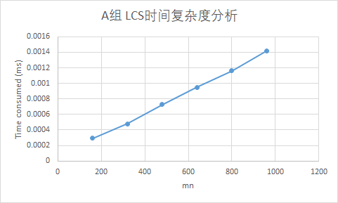

[TOC]

# 算法基础 -- 上机实验2

## 实验内容及要求

###	实验内容

#### ex1

* 实现求最优二叉搜索树算法。关键字 n 数目为5, 9, 13,17, 21。输入在相应的txt文件中，输出要求打印二叉树，并给出期望搜索代价。统计算法运行所需时间 ，画出时间曲线，并进行性能分析。

#### ex2

* 实验2：实现求最长公共子序列的算法。序列 X 的长为 m，序列 Y的长为 n，序列 X 和 Y 的元素从 26个大写字母中随机生成，m 和 n 的取值:

    第1组： (16， 10)， (16， 20)， (16， 30)， (16，40)， (16，50)， (16，60)

    第2组： (15， 26)， (30， 26)， (45，26)， (60，26)， (75，26)， (90，26)  

    给出算法运行所需的时间，画出时间曲线 ，进行性能分析。

### 实验要求

实验格式：

* 实验需建立根文件夹，文件夹名称为：学号-project2，在根文件夹下需包括实验报告、和ex1，ex2两个子文件夹，子文件夹又分别包含3个子文件夹：

  * input文件夹：存放输入数据
  * source文件夹：源程序
  * output文件夹：输出数据

* input:

  * 实验一

    * 输入文件中每三行对应一个输入规模的搜索概率

    * 第一行为关键字数目N，第二行为关键字的搜索概率，第三行为伪关键字的搜索概率。

    * example：计算关键字为N的最优二叉搜索树问题，其输入文件路径为：

       	学号-project2/ex1/input/input.txt，顺序读取4,5,6行数据进行计算。

  * 实验二 

    * 输入按照题目要求分为两组，第一组生成的6对随机字符串存在input文件夹下inputA.txt中供程序读取，第二组生成的6对随机字符串存放在inputB.txt中，每行一个随机字符串。

    * example：计算第一组的第3对字符串的最长公共子序列，其输入文件路径为：

        	学号-project2/ex2/input/inputA.txt，顺序读取第5,6个字符串进行LCS的求解。

* output:

  * 实验一

    * 输出结果导入到ex1/output的对应文件下面
  
    * result.txt:输出不同规模的最优二叉搜索树，并给出期望搜索代价，不同规模的结果都写到同一个文件中，每行输出相应的二叉搜索树。
      
* time.txt:运行时间效率的数据，不同规模的时间都写到同个文件
      
  * example:对5个关键字的最优二叉搜索树的输出应为：期望搜索代价，二叉搜索树的前序遍历结果（2.75，k2 k1 d0 d1 k5 k4 k3 d2 d3 d4 d5），执行结果与运行时间的输出路径分别为：
    
       	学号-project2/ex1/output/result.txt 
    
          	学号-project2/ex1/output/time.txt 
    
  * 实验二
  
    * 输出结果导入ex2/output到对应文件下面
      * result_n.txt：输出不同规模字符串组的最长公共子序列长度，以及一个对应的具体子最长公共子序列。不同规模的结果都写到同一个文件中，每行输出一种规模的结果。  
      * time.txt：运行时间效率的数据，不同规模的时间都写到同个文件。
  
  * example:对第一组中规模为(15,20)的最长公共子序列求解输出应为：A组规模为(15,20)的字符串组的LCS长度为：5，其中一个解为：’CAGDT’，执行结果与运行时间的输出路径分别为：
  
     	学号-project2/ex2/output/result.txt 
  
    ​	 学号-project2/ex2/output/time.txt 

### 注意事项

* 实验报告中要有必要的实验过程截图和图表；
* 图片要有单位，横纵坐标等信息；
* ex1,ex2目录结构严格按照实验格式的要求；
* 代码中需要有必要的注释；
* 实验杜绝抄袭他人代码或者实验结果，如发现代码高度相似或者实验报告雷同者算0分；

## 实验设备和环境

* 实验设备：ThinkPad T470P
* 软件环境：
  * Host: windows 10 1903
  * client: windows subsystem for linux
  * wsl: Linux DESKTOP-3CEJIAK 4.4.0-18362-Microsoft #1-Microsoft
  * language: python 3.6.8

## 实验方法和步骤

### 实验一

相对来说比较简单，按照书上代码进行设计即可：

主要部分为 `optimal_bst(p, q, n)`函数

其逻辑跟书上基本一致，因此不过多介绍

```python
#p 为关键字搜索概率
#q 为伪关键字搜索概率
#n 为规模
def optimal_bst(p,q,n):
    e = np.zeros((n+2, n+1))
    w = np.zeros((n+2,n+1))
    root = np.zeros((n+1,n+1))
    for i in range(1, n+2):
        e[i][i-1] = q[i-1]
        w[i][i-1] = q[i-1]
    for l in range(1,n+1):
        for i in range(1, n-l+2):
            j = i+l-1
            e[i][j] = 99999
            w[i][j] = w[i][j-1] + p[j-1] + q[j]
            for r in range(i, j+1):
                t = e[i][r-1] + e[r+1][j] + w[i][j]
                if t < e[i][j]:
                    e[i][j] = t
                    root[i][j] = r
    return e, root
```

比较有挑战的是print_tree设计，根据optimal_bst产生的root矩阵输出先序遍历的树结构

```python
#table为 root 矩阵
#begin 为开始的关键字下标
#end 为结束的关键字下表
#i 为伪关键字的序号
def print_tree(table,begin,end, i):
    root = int(table[begin][end])    	#根据root表的性质，root[begin][end]即为关键字下表从begin到end所对应的最优二叉搜索树的根节点
    print('k{}'.format(root),end=' ') 	#先序遍历输出根节点
    if root == begin:  					#此时，此root节点没有关键字左子树，只有伪关键字左子树
        print('d{}'.format(i),end=' ')	#输出此伪关键字节点
        i = i + 1						#i++, 指向下一个伪关键字节点
    else:								#还有关键字左子树，递归查询
        i = print_tree(table, begin, root-1, i)  
    
    if root == end:						#对右子树分析，同理
        print('d{}'.format(i),end=' ')
        i = i + 1
    else:
        i = print_tree(table, root+1, end, i)
    return i							# 返回当前指向伪关键字的序号
```

配合一个简单的main函数，即可实现预计目标

```python
if __name__ == '__main__':
    timeTXT = open('output/time.txt','w')
    ret = readData(inputFile)
    for key, value in ret.items():
        p, q = value
        t1 = time.time()
        e, root = optimal_bst(p, q, key)
        t2 = time.time()
        timeTXT.writelines(str(t2-t1) + ' ms\n')
        print(e[1][-1], end=', ')
        print_tree(root, 1, key, 0)
        print()
    timeTXT.close()
```

### 实验二

##### 产生随机字符串

利用radom即可产生随机字符串

```python
import random   

def createString(length):
    letter = [chr(i) for i in range(65, 91)]  #所有的大写英文字符
    retString = ''
    for i in range(length):
        retString = retString + str(random.sample(letter, 1)[0])
    return retString
```

#### LCS算法

和书上逻辑一致

```python
''' 
1 代表左上
2 代表上
3 代表左
'''
def LCS(str1, str2):
    m = len(str1)
    n = len(str2)
    b = np.zeros((m+1,n+1),dtype=int)       #利用numpy包得到二维数组
    c = np.zeros((m+1, n+1),dtype=int)
    for i in range(0,m):
        for j in range(0, n):
                if str1[i] == str2[j]:		
                    c[i+1][j+1] = c[i][j] + 1
                    b[i+1][j+1] = 1  		#1表示左上
                elif c[i][j+1] >= c[i+1][j]:
                    c[i+1][j+1] = c[i][j+1] 
                    b[i+1][j+1] = 2   		#2表示上
                else:
                    c[i+1][j+1] = c[i+1][j]
                    b[i+1][j+1] = 3   		#3表示左
    return b,c
#c[-1][-1]中存储着最长公共子序列的长度
```

打印LCS，根据箭头逆序查找即可

```python
#b LCS产生的b
#str1 字符串1
#(x,y) root坐标
def print_LCS(b,str1,x,y):
    if x == 0 or y == 0:
        return ''
    if b[x][y] == 1:      			#1表示左上
        print_LCS(b,str1,x-1, y-1)
        print(str1[x-1], end='')
    elif b[x][y] == 2:				#2表示上
        print_LCS(b,str1,x-1,y)
    else:							#3表示左
        print_LCS(b, str1, x, y-1)
```

main函数设计

```shell
import createString
import readSize
import os
import time
import sys
import LCS

if __name__ == '__main__':
    size = readSize.readSize('input/size.txt')
    
    inputA = open('input/inputA.txt','w') 			#每轮都会随机产生字符串，所以这里写入时为了保存，而不是读取
    inputB = open('input/inputB.txt','w')
    timeTXT = open('output/time.txt', 'w')
    for key, value in size.items():
        for m,n in value:
            str1 = createString.createString(m)		#产生指定长度的字符串
            str2 = createString.createString(n)
            if(key == str('A')):					#将产生的字符串保存起来
                inputA.writelines(str1+'\n')
                inputA.writelines(str2+'\n')
            else:
                inputB.writelines(str1+'\n')
                inputB.writelines(str2+'\n')
            t1 = time.time()
            b, c = LCS.LCS(str1, str2)
            #通过重定向的方式，保存到output/result.txt
            #python src/main.py > output/result.txt
            print('{}组规模为({}, {})的字符串组的LCS长度为：{}，其中一个解为：'.format(key,m,n,c[-1][-1]), end='')
            LCS.print_LCS(b, str1, m,n)
            print()
            t2 = time.time()
            timeTXT.writelines(str(t2-t1)+' ms\n' )
```

## 实验结果与分析

### 实验一

产生的输出文件有两个, 其内容为

* result.txt:

  ```shell
  2.75, k2 k1 d0 d1 k5 k4 k3 d2 d3 d4 d5 
  3.3100000000000005, k6 k3 k2 k1 d0 d1 d2 k5 k4 d3 d4 d5 k8 k7 d6 d7 k9 d8 d9 
  3.2687, k4 k1 d0 k3 k2 d1 d2 d3 k10 k6 k5 d4 d5 k9 k8 k7 d6 d7 d8 d9 k13 k12 k11 d10 d11 d12 d13 
  3.234000000000001, k3 k1 d0 k2 d1 d2 k7 k5 k4 d3 d4 k6 d5 d6 k12 k9 k8 d7 d8 k10 d9 k11 d10 d11 k14 k13 d12 d13 k15 d14 k17 k16 d15 d16 d17 
  3.5020000000000007, k7 k4 k2 k1 d0 d1 k3 d2 d3 k6 k5 d4 d5 d6 k12 k9 k8 d7 d8 k10 d9 k11 d10 d11 k17 k15 k13 d12 k14 d13 d14 k16 d15 d16 k20 k18 d17 k19 d18 d19 k21 d20 d21 
  ```
  
* time.txt：

  ```shell
  0.000102996826171875 ms
  0.0003407001495361328 ms
  0.0008249282836914062 ms
  0.0016913414001464844 ms
  0.00296783447265625 ms
  ```

理论上result结果是没有错误的。

时间复杂度分析：


直接对数据进行分析比较难判断时间复杂度，由于我们理论上以及知道，时间复杂度为O(n^3^)\

所以我们可以对时间开立方根后进行分析，得到下表


可以看到，线性性非常强，可以任务时间复杂度为O(n^3^)，和理论一致

（那个符号打不出，所以用O代替）

### 实验二

产生的文件也有两个，其内容为：

* result.txt:

  ```shell
  A组规模为(16, 10)的字符串组的LCS长度为：2，其中一个解为：LK
  A组规模为(16, 20)的字符串组的LCS长度为：4，其中一个解为：OHBZ
  A组规模为(16, 30)的字符串组的LCS长度为：4，其中一个解为：VVMI
  A组规模为(16, 40)的字符串组的LCS长度为：7，其中一个解为：CUZIDBW
  A组规模为(16, 50)的字符串组的LCS长度为：7，其中一个解为：LWNUKXE
  A组规模为(16, 60)的字符串组的LCS长度为：6，其中一个解为：HBJJTW
  B组规模为(15, 26)的字符串组的LCS长度为：5，其中一个解为：DOJEC
  B组规模为(30, 26)的字符串组的LCS长度为：9，其中一个解为：MAFOQYTZV
  B组规模为(45, 26)的字符串组的LCS长度为：9，其中一个解为：VLYULEKAB
  B组规模为(60, 26)的字符串组的LCS长度为：13，其中一个解为：LMIARPHPQUHKL
  B组规模为(75, 26)的字符串组的LCS长度为：12，其中一个解为：ULLNZZHDTFRG
  B组规模为(90, 26)的字符串组的LCS长度为：12，其中一个解为：GEGDTJMBCBXN
  ```

* time.txt：（记录生成LCS和打印最长公共子序列的时间，主要取决于生成LCS的时间）

  ```shell
  0.0002923011779785156 ms
  0.0004794597625732422 ms
  0.0007278919219970703 ms
  0.0009486675262451172 ms
  0.0011620521545410156 ms
  0.0014209747314453125 ms
  0.0005733966827392578 ms
  0.0011374950408935547 ms
  0.0018191337585449219 ms
  0.002257108688354492 ms
  0.0028450489044189453 ms
  0.0035200119018554688 ms
  ```

通过随机抽样，我觉得没有错误。

时间复杂度分析：




有A、B两组数据，可以得知 时间开销和mn有很大的线性性

可以认为时间复杂度为O(mn)，和理论比较一致

## 实验总结

复习了LCS和最优二叉搜索树算法

进一步了解了动态规划

锻炼了一点python coding 


