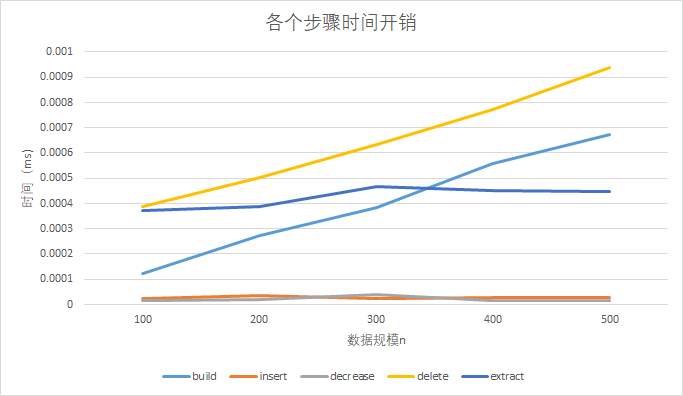

[TOC]

[TOC]

# 算法基础 -- 上机实验3

## 实验内容及要求

###	实验内容

分别实现二叉堆（最小堆）和斐波那契堆，并实现以下操作算法：

* INSERT(S,x):把元素x插入堆S中。
* DELETE(S, x):从堆S中删除元素x。
* EXTRACT-MIN(S):去掉并返回S中具有最小关键字的元素。
* DECREASE-KEY(S,x,k):将元素x的关键字值减小到k(x≥k)。

1. 有整数 n ，使用n 个互异的正整数（K1, K2, K3, ……, Kn）, 以这 n 个正整数作为节点的关键字，建立二叉堆（斐波那契堆）（建堆）；
2. 向堆中插入m个元素（INSERT）；
3. 将k个指定元素的关键字减少10（DECREASE-KEY）；
4. 删除s个指定元素（DELETE）；
5. 对堆执行t次EXTRACT-MIN操作（EXTRACT-MIN）。

要求：分别统计插入、删除、减少值和抽取最小结点平均每次操作运行所需时间，画出时间曲线，输出EXTRACT-MIN操作的返回值。

### 实验要求

实验格式：

* 实验需建立根文件夹，文件夹名称为：学号-project3，在根文件夹下需包括实验报告、和ex1一个子文件夹，子文件夹又分别包含3个子文件夹：

  * input文件夹：存放输入数据
  * source文件夹：源程序
  * output文件夹：输出数据

* input:

  * 共有5组输入文件

  * 每组输入文件中包含5个txt文件：build.txt,insert.txt,decrease.txt,delete.txt,extract.txt

  * 每个txt文件中，第一行表示要执行的操作次数，其余为元素的关键字。如build.txt中，第一行表示建堆元素数目n，第二行到最后一行为建堆元素的关键字；insert.txt中，第一行表示待插入元素个数，第二行到最后一行表示待插入元素的关键字，decrease.txt，delete.txt中表示形式与insert.txt中相同；extract.txt中只有一行，表示操作执行次数。

  * example：对最小堆进行建堆操作，其输入文件路径为：

     	学号-project3/ex1/input/data1/build.txt，顺序读取数据进行操作。

* output:

  * 输出结果导入到ex1/output的对应文件下面

    * result.txt:输出不同输入文件中EXTRACT-MIN操作的返回值。
    * time.txt:运行时间效率的数据，不同规模的时间都写到同个文件。
  
  *	example:对最小堆的输出应为：堆中最小的t个元素，执行结果与运行时间的输出路径为：
    
     ​	学号-project3/ex1/output/binary_heap/result.txt 
    
    ​    学号-project3/ex1/output/binary_heap/time.txt
  

### 实验报告要求

1. 必须包含实验内容及要求、实验设备和环境、实验方法和步骤、实验结果与分析
2. 用适当的方法，或工具记录算法在执行时所消耗的时间；
3. 根据不同输入规模时记录的数据，画出算法在不同输入规模下的运行时间曲线图；比较你的曲线是否与课本中的算法渐进性能是否相同，若否，为什么，给出分析。

### 注意事项

* 实验报告中要有必要的实验过程截图和图表；
* 图片要有单位，横纵坐标等信息；
* ex1,ex2目录结构严格按照实验格式的要求；
* 代码中需要有必要的注释；
* 实验杜绝抄袭他人代码或者实验结果，如发现代码高度相似或者实验报告雷同者算0分；

## 实验设备和环境

* 实验设备：ThinkPad T470P
* 软件环境：
  * Host: windows 10 1903
  * client: windows subsystem for linux
  * wsl: Linux DESKTOP-3CEJIAK 4.4.0-18362-Microsoft #1-Microsoft
  * language: python 3.6.8

## 实验方法和步骤

### 二叉堆设计：

二叉堆的数据结构采用python list形式实现

算法本质和书上并无太大差异，主要是为了适应python 从0开始的下标对`parent`, `left` ,`right` 做了一定改进

```python
def LEFT(i):
    return (i+1) * 2 - 1

def RIGHT(i):
    return (i+1) * 2 

def PARENT(i):
    return int((i+1)/2) - 1
```

其他的和书本上基本一致，所以主要介绍`DELETE`函数，此函数书上没有具体实现

```python
#此处的i为二叉堆中的元素,而不是元素所指向的关键字
def DELETE(A, i):
    length = len(A)
    if i >= length:
        print("There is no element {}".format(i))
        return -9999
    A[i] = A[-1]   #将最后一个元素填充到i处，并删除最后一个元素
    del A[-1]

    l = LEFT(i)
    r = RIGHT(i)
    length = length - 1
    #上诉操作完成后，有两种情况
    #第一种情况是，当前A[i] 比 它们的孩子都要大，此时比如不满足二叉堆性质，所以要用MIN_HEAPIFY函数将此节点下沉
    #第二种情况是，当时A[i]虽然比它的孩子小，但是A[i]的父亲比A[i]大，此时也不满足最小二叉堆性质，需要将A[i]和它的父亲交换
    #这两种情况下，最坏的情况下，时间复杂度也为O(logn)
    if (l < length and A[i] > A[l]) or  (r < length and A[i] > A[r]):
        MIN_HEAPIFY(A, i)

    else:
        p = PARENT(i)
        x =  i
        while p >= 0 and A[p] > A[x]:
            A[p], A[x] = A[x], A[p]
            x = p
            p = PARENT(x)
    return 0
```

### 斐波那契堆设计

斐波那契堆实现就比最小二叉堆复杂得多得多

我还是用python实现斐波那契堆

用两个对象来实现此斐波那契堆，一个为`FibonacciHeapNode`，另一个为`FibonacciHeap`

`FibonacciHeapNode`结构

```python	
class FibonacciHeapNode:
    def __init__(self, key = None, degree = None, p = None, child = None, \
                left = None, right = None, mark = None):
        self.key = key			#关键字
        self.degree = degree	#度
        self.p = p				#父亲节点
        self.child = child		#孩子节点
        self.left = left		#左兄弟节点
        self.right = right		#右兄弟节点
        self.mark = mark		#标记
```

`FibonacciHeap`结构

```python
class FibonacciHeap:
    def __init__(self):
        self.min = None		#最小元素的指针
        self.cons = []		#consolidate用到的数组
        self.keyNum = 0		#元素个数
        self.maxDegree = 0	#最大的度
```

`FibonacciHeap`有大量的方法，它们的介绍如下，具体细节不展开

```python
#初始化堆
makeHeap()
#建立带关键字的节点
makeNode(key)
#将node添加到root左侧
addNode(node : FibonacciHeapNode, root : FibonacciHeapNode)
#删除节点
removeNode(node : FibonacciHeapNode)
#插入节点
insert(node : FibonacciHeapNode)
#插入关键字（实际上先调用Makenode(key)， 随后addNode(node, heap.min)
insertKey(key)
#初始化heap.cons
makeCons()
#溢出heap.min
removeMin()
#书上说的那个功能
link(node : FibonacciHeapNode, root : FibonacciHeapNode)
#就是书上的说的那个功能，比较难形容
consolidate()
#移除heap.min, 并返回
extractmin()
#将某个节点的关键字减小到key
decreaseKey(node : FibonacciHeapNode, key)
#更新节点的degree
renewDegree(parent : FibonacciHeapNode, degree : int)
#书上说的那个功能
cut(node : FibonacciHeapNode, parent : FibonacciHeapNode)
#书上说的那个功能
cascadingCut(node : FibonacciHeapNode)
#删除节点
delete(node : FibonacciHeapNode)
#查找关键字key所对应的节点，是searchFromRoot的分装
search(key)
#在root这个堆中，查找关键key对应的节点
searchFromRoot(root : FibonacciHeapNode, key)
```

### 读取数据

专门设计了一个`readData`是读取输入数据

```python
def read(Path):
    with open(Path) as f:
        lines = f.readlines()
        ret = []
        for line in lines:
            ret.append(int(line))
    return ret
```

### Main函数设计

我这次实验Main函数设计的实在是有点丑，不是非常想放出来

就放一部分

```python
 		print("build")
        btime.writelines("build:    ")
        ftime.writelines("build:    ")
        t1 = time.time()
        heap = operations.BUILD_MIN_HEAP(BUILD[1:].copy())
        t2 = time.time()
        btime.writelines("{} \n".format(t2 - t1))
        
        ······
        ······
        
        print('delete')
        ftime.writelines("delete:   ")
        btime.writelines("delete:   ")
        
        sum = 0
        for i in DELETE[1:]:
            x = heap.index(i)
            t1 = time.time()
            operations.DELETE(heap, x)
            t2 = time.time()
            sum = sum + t2 - t1

        btime.writelines("{} \n".format(sum))  #保存计时

        sum = 0
        for i in DELETE[1:]:
            x = Fheap.search(i)
            t1 = time.time()
            Fheap.delete(x)
            t2 = time.time()
            sum = sum + t2 - t1

        ftime.writelines("{} \n".format(sum)) #保存计时
```


## 实验结果与分析

### 实验结果分析

能够正确完成预计功能

`binary_heap/result.txt`存的是`extractmin`函数输出的内容为

```shell
100
7 11 11 12 13 22 26 30 32 39 46 50 52 55 57 62 64 67 73 74 
200
11 11 13 14 15 16 18 20 22 25 26 29 30 35 37 41 42 44 45 46 
300
11 12 13 14 17 19 20 21 22 27 28 30 32 33 35 38 39 40 42 44 
400
11 12 13 14 17 18 19 21 22 23 25 27 28 29 31 32 33 34 35 36 
500
12 13 14 15 16 17 18 21 22 23 24 25 26 27 28 29 30 31 33 34 
```

`binary_heap/time.txt`内容为

```shell
100
build:    5.936622619628906e-05 
insert:   4.315376281738281e-05 
decrease: 2.1219253540039062e-05 
delete:   3.528594970703125e-05 
extract:  7.414817810058594e-05 
200
build:    9.942054748535156e-05 
insert:   3.266334533691406e-05 
decrease: 2.1696090698242188e-05 
delete:   3.361701965332031e-05 
extract:  0.00011730194091796875 
300
build:    0.00014209747314453125 
insert:   3.3855438232421875e-05 
decrease: 1.9550323486328125e-05 
delete:   3.814697265625e-05 
extract:  9.131431579589844e-05 
400
build:    0.0001990795135498047 
insert:   3.719329833984375e-05 
decrease: 2.0503997802734375e-05 
delete:   3.5762786865234375e-05 
extract:  9.632110595703125e-05 
500
build:    0.00025200843811035156 
insert:   3.337860107421875e-05 
decrease: 2.0265579223632812e-05 
delete:   4.1961669921875e-05 
extract:  9.799003601074219e-05 
```

`fibonacci_heap`文件夹内容类似

同样也用diff来比较两次实现的结果


可以认为两个数据结构都得到了正确的实现

### 时间复杂度分析

#### 二叉堆


除了建堆过程，可以非常明显的看出时间复杂度为O(n)，符合理论时间复杂度外，其他操作的时间复杂度不是非常明显。

主要原因是，另外几个操作时间复杂度理论上都为O(logn)，当n在100到500之间变化时，仅有非常小的变换，而又因为内存访问，cache命中率等原因，导致其他四个操作时间变化并没有太多规律。

#### 斐波那契堆



由于数据规模比较小，所以变化并不是非常明显。

但还是能看出，build时间复杂度为O(n)符合理论性能

insert、decrease时间开销基本不变，符合O(1)的理论性能

extract理论时间复杂度为O(lgn)，这里由于数据规模太小，不能很好体现

delete操作，调用了decrease和extract，这里应该也是因为数据规模较小，不能非常好的提出其时间复杂度

## 实验总结

* 实现了二叉堆和斐波那契堆。
* 斐波那契堆的实现太过复杂了，python都写了两三百行，这可能是其虽然拥有不错的理论性能，但没有在业界大规模使用的原因之一。
* 我再也不赶ddl，太累了


