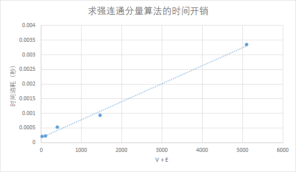

[TOC]

# 算法基础 -- 上机实验5

## 实验内容及要求

###	实验内容

#### ex1

* 实验1：实现求有向图的强连通分量的算法。有向图的顶点数 N 的取值分别为： 9、27、81、243、729， 弧的数目为 Nlog~3~N, 统计算法所需运行时间 ，画出时间曲线。

#### ex2

* 实验2：实现求所有点对最短路径的Johnson算法。有向图的顶点数 N 的取值分别为:  27、81、243、729 ，同一顶点数目对应两种弧的数目： Nlog~5~N和Nlog~7~N（取下整）, 统计算法所需运行时间 ，画出时间曲线。

### 实验要求

实验格式：

* 实验需建立根文件夹，文件夹名称为：学号-project5，在根文件夹下需包括实验报告、和ex1，ex2两个子文件夹，子文件夹又分别包含3个子文件夹：

  * input文件夹：存放输入的图数据
  * source文件夹：源程序
  * output文件夹：输出数据

* input:

  * 实验一

    * 每种输入规模分别建立txt文件，文件名称为input1.txt, input2.txt,……,input5.txt ;
* 生成的有向图信息分别存放在对应数据规模的txt文件中；
    * 每行存放一对结点i,j序号（数字表示），表示存在一条结点i指向结点j的边。
* example：计算数据规模为9的最强连通分量的实验，其输入文件路径为：
    * 学号-project5/ex1/input/input1.txt，顺序读取数据进行计算。

  * 实验二 

    * 每种输入规模分别建立txt文件，文件名称为input11.txt, input12.txt,……,input42.txt （第一个数字为顶点数序号（27、81、243、729 ），第二个数字为弧数目序号（ Nlog~5~N、Nlog~7~N ））；
* 生成的有向图信息分别存放在对应数据规模的txt文件中；
    * 每行存放一对结点i,j序号（数字表示）和w~ij~，表示存在一条结点i指向结点j的边，边的权值为w~ij~ ，权值范围为（-10,30）。
* Input文件中为随机生成边以及权值，实验首先应判断输入图是否包含一个权重为负值的环路，如果存在，请自行对输入图的边以及权值重新随机生成以保证实验正确进行，实验输出为重新生成后数据的实验结果，并在实验报告中说明。
    * example：计算数据规模为9的所有点对最短路径的实验，其输入文件路径为：
  * 学号-project5/ex2/input/input1.txt，顺序读取数据进行计算。
  
* output:

  * 实验一

    * 输出结果导入到ex1/output的对应文件下面
  
      * result.txt:输出对应规模图中存在的所有连通分量，不同规模写到不同的txt文件中，因此共有5个txt文件，文件名称为result1.txt,result2.txt,……,result5.txt;输出的连通分量数据要表示清楚，同一连通分量的结点序列用一对括号括起来输出到对应的txt文件中。
      * time.txt:运行时间效率的数据，不同规模的时间都写到同个文件。
    * example:对数据规模为9的连通分量实验输出应为：(1,3,5)(2,4,6,9)(7,8)，执行结果与运行时间的输出路径分别为：
      * 学号-project5/ex1/output/result1.txt 
      * 学号-project5/ex1/output/time.txt 
  * 实验二
  
    * 输出结果导入ex2/output到对应文件下面
      * result.txt：输出对应规模图中所有点对之间的最短路径包含结点序列及路径长，不同规模写到不同的txt文件中，因此共有8个txt文件，文件名称为result11.txt,result12.txt,……,result42.txt; 输出的最短路径要表示清楚，在一条最短路径的结点序列用一对括号括起来输出到对应的txt文件中，并输出路径长度。
      * time.txt:运行时间效率的数据，不同规模的时间都写到同个文件。
    * example:对顶点为27，边为54的所有点对最短路径实验输出应为：(1,5,2 20)(1,5,9,3 50)……，执行结果与运行时间的输出路径分别为：
      * 学号-project5/ex2/output/result11.txt 
      * 学号-project5/ex2/output/time.txt 
  

### 实验报告要求

* 进行算法实现时选取合适的数据结构和实现方法来表示图。
* 必须包含实验内容及要求、实验设备和环境、实验方法和步骤、实验结果与分析
* 用适当的方法，或工具记录算法在执行时所消耗的时间；
* 代码中需要有必要的注释；
* 根据不同输入规模时记录的数据，画出算法在不同输入规模下的运行时间曲线图；比较你的曲线是否与课本中的算法渐进性能是否相同，若否，为什么，给出分析。

### 注意事项

1. 实验报告中要有必要的实验过程截图和图表；
2. 图片要有单位，横纵坐标等信息；
3. ex1,ex2目录结构严格按照实验格式的要求；
4. 代码中需要有必要的注释；实验杜绝抄袭他人代码或者实验结果，如发现代码高度相似或者实验报告雷同者算0分；

## 实验设备和环境

* 实验设备：ThinkPad T470P
* 软件环境：
  * Host: windows 10 1903
  * client: windows subsystem for linux
  * wsl: Linux DESKTOP-3CEJIAK 4.4.0-18362-Microsoft #1-Microsoft
  * language: python 3.6.8

## 实验方法和步骤

### 图的表示

本次两个子实验都涉及有向图，且规模从小到大极不平衡，未来节约内存和提高效率，使用`python`中的字典对图进行表示。

利用单层字典表示弧边，双层字典表示权重。

对任意节点`u`而言，G[u]为一字典，相邻节点作为key，权值作为value；即

* ```python
  if v is in G[u].keys():
      则 u -> v ^ W(u, v) = G[u][v]
  ```

### ex1实现

实验一为求图的强联通分量，由书上算法知，只需进行两次DFS，一次正常dfs得到拓扑排序，第二次根据拓扑排序结果反向dfs，所得的搜索结果即为各个联通片，所以主要由三个函数组合完成此任务：

* tr(G)：求图G的转置
* topoSort(G)：对G进行DFS，得到一个偏序关系
* walk(G)：第二次DFS，得到最终结果

----

`tr(G)`

```python
#G为输入的图，GT为转置后得到的图
#由于G使用字典存储，所以GT只需将G中key,value对应关系颠倒即可得到GT
def tr(G):
    GT = dict()
    for value in G.keys():
        #初始GT
        GT[value] = set()
    for key in G.keys():
        for value in G[key]:
            #开始转置
            if value not in GT.keys():
                GT[value] = set()
            GT[value].add(key)
    return GT
```

---

`topoSort(G)`

本质为DFS，根据节点搜索完成的时间先后对节点进行排序

```python
def topoSort(G):
    res=[]	#res用于按完成时间的先后顺序记录完成探索的节点
    S=set() #集合S用于记录以及探索过的节点

    #定义DFS算法
    def dfs(G,u):
        if u in S: #已经探索过
            return
        S.add(u)
        for v in G[u]:
            if v in S:
                continue
            dfs(G,v)
        res.append(u)
        
	#由于图G可能不是连通图，所以需要对所有的节点都进行DFS
    for u in G.keys():
        dfs(G,u)

    res.reverse() #由此得到的res记录了图G中最先完成探索的节点。
    return res
```

----

`walk（G, s, S)`

```python
#在图G中由s点开始进行DFS,同时记录由此节点可达的所有子节点
def walk(G,s, S):
    Q=[]
    P=dict()
    Q.append(s)
    P[s]=None	#用于记录由s可达的节点，由算法定义，P最终即为包含s的强连通分量
    while Q:
        u = Q.pop()
        for v in G[u]:
            if v in P.keys() or v in S:	#子节点已经被别记录了
                continue
            Q.append(v)
            P[v]=P.get(v,u)

    return P

def getStrConnect(G):
    seen = set()	#用于记录已经探索的节点
    scc = []		#用于记录强连通分量
    GT = tr(G)
    for node in topoSort(G):
        if node in seen:
            continue
        C = walk(GT, node, seen)
        seen.update(C)	#更新以及检索过的结点
        scc.append(sorted(list(C.keys())))

    return scc
```

由上诉几个函数，即可完成对图G的强连通分量的求解

### ex2实现

ex2中图的数据结构与ex1类似，只是多了权重信息。

为了实现`johnson`算法，必须实现`dijkstra`和`bellman ford`算法。

`johnson`算法介绍：

1. 给定图 G = (V, E)，增加一个新的顶点 s，使 s 指向图 G 中的所有顶点都建立连接，设新的图为 G’；
2. 对图 G’ 中顶点 s 使用 [Bellman-Ford 算法](http://www.cnblogs.com/gaochundong/p/bellman_ford_algorithm.html)计算单源最短路径，得到结果 h[] = {h[0], h[1], .. h[V-1]}；
3. 对原图 G 中的所有边进行 "re-weight"，即对于每个边 (u, v)，其新的权值为 w(u, v) + (h[u] - h[v])；
4. 移除新增的顶点 s，对每个顶点运行 [Dijkstra 算法](http://www.cnblogs.com/gaochundong/p/dijkstra_algorithm.html)求得最短路径；

----

`dijsktra`实现

`dijsktra`算法实现尤其是时间效率非常依靠底层的数据结果，这个我使用`python`自带的`heapq`，`heapq`本身为一个有限对了，所以可以借此实现`dijsktra`算法，`heapq`内部实现为一个二叉堆。

```python
def dijkstra(G, s):
    D, P, Q, S = {s: 0}, {}, [(0, s)], set() #初始化
    # D: D为距离， D[u]记录s到u的距离
    # P: P为前驱， D[u]为从s到u的路径上u的直接前驱
    # Q: Q为被发现的节点集合
    # S: S为已经已经探索完的节点结合
    while Q:
        _, u = heappop(Q)
        if u in S:
            continue
        S.add(u)
        for v in G[u]:
            relax(G, u, v, D, P) #松弛操作
            heappush(Q, (D[v], v)) #扩展子节点
    return D, P
```

---

`bellman-ford`实现

```python
#D, P性质同上
#s为起始节点
def bellman_ford(G, s):
    D, P = dict(), dict()
    D[0] = 0
    for rnd in G:
        changed = False
        for u in G:
            for v in G[u]:
                if relax(G, u, v, D, P):
                    changed = True
        if not changed: #未对距离进行更改，因而算法以及收敛，介绍。
            break
    else:	#图路径中存在权值为负的闭合回路
        return False, False
    return D, P

```

---

`johnson(G)`实现

由以上两个算法，即可构造`johnson(G)`

```python
def johnson(G):
    G = deepcopy(G)
    s = 0
    G[s] = {v: 0 for v in G}	#添加一个节点。
    h, _ = bellman_ford(G, s) #由bellman-ford算法得出h(x),从而得到非负的W(x)
    del G[s]
    for u in G:
        for v in G[u]:
            G[u][v] += h[u] - h[v] #计算W(X)
    D, P = dict(), dict()
    for u in G: #对新图中对各个节点使用dijkstra
        D[u], P[u] = dijkstra(G, u)
        for v in G: #还原为最初的路径长度
            if v not in D[u]:
                D[u][v] = inf
            else:
                D[u][v] += h[v] - h[u]
    return D, P   
```

----

图存在权值为负的闭合回路

`johnson`算法利用`bellman-ford`算法，能够发现存在权值为负的闭合回路，但此时不能求解。我们可以对图G进行随机修正，使得G中不存在权值为负的闭合回路，使得`johnson`可以发生作用。

当读取完输入图后，首先利用`bellman-ford`算法对G进行测试

```python
def testGraph(G):
    G = deepcopy(G)
    s = 0
    G[s] = {v: 0 for v in G}
    D, _ = bellman_ford(G, s) #利用bellman-ford算法对图进行检验
    if type(D) != type(False): #不存在权值为负的闭合回路
        del G[s]
        return "Ok", G
    while type(D) == type(False):	#存在权值为负的闭合回路
        correctGraph(G)				#修正
        D, _ = bellman_ford(G, s)	#再次检测，直到图G满住条件

    del G[s]
    return "Corrected", G

#对存在权值为负的闭合回路的图进行修正
#对权值为负的边，随机概率（q = 0.5)变为其相反数
#对权值为非负的边，不做任何变换
def correctGraph(G):
    for u in G:
        for v in G[u]:
            if G[u][v] < 0:
                if random.randint(0,1) == 1:
                    G[u][v] = -G[u][v]
    return G
```


综上，总的实现逻辑为

```python
G = readGraph(path, N[i-1])
status, G = testGraph(G)
print(status + " " + path)
D, P = johnson(G)
```

## 实验结果与分析

### 正确性分析

由于算法实现正确性比较难验证，所以采用不是非常完备的简单验证。

利用小规模的图对ex1和ex2进行验证。

另外，针对ex1，其对数据得到的结果中，存在只有一个节点的联通片，这些结点易于进行验证，利用此验证判断算法实现是否正确。

通过以上的收到，可以以比较高的确信度认为，算法实现是正确的。

### 输出

* ex1

  ex1输出为各个连通片，例如对`input1.txt`, 其输出结果为

  ```shell
  ( 1, 5, 7 )( 2, 3, 8, 9 )( 4 )( 6 )
  ```

* ex2输出 N * N对从 i 到 j 的最短路径和距离。（None, inf) 表示不可达。以`input11.txt`为例，其部分结果为

  ```shell
  u->v   	路径  	距离
  1->1	( 1 -> 1, 0 )
  1->2	( None, inf )
  1->3	( 1 -> 22 -> 25 -> 3, 22 )
  1->4	( 1 -> 22 -> 25 -> 3 -> 21 -> 7 -> 13 -> 15 -> 26 -> 6 -> 12 -> 4, 60 )
  1->5	( None, inf )
  1->6	( 1 -> 22 -> 25 -> 3 -> 21 -> 7 -> 13 -> 15 -> 26 -> 6, 34 )
  1->7	( 1 -> 22 -> 25 -> 3 -> 21 -> 7, 36 )
  1->8	( 1 -> 22 -> 25 -> 3 -> 8, 30 )
  1->9	( 1 -> 22 -> 25 -> 3 -> 10 -> 9, 40 )
  1->10	( 1 -> 22 -> 25 -> 3 -> 10, 21 )
  1->11	( 1 -> 22 -> 25 -> 3 -> 21 -> 7 -> 11, 56 )
  1->12	( 1 -> 22 -> 25 -> 3 -> 21 -> 7 -> 13 -> 15 -> 26 -> 6 -> 12, 37 )
  1->13	( 1 -> 22 -> 25 -> 3 -> 21 -> 7 -> 13, 31 )
  1->14	( None, inf )
  1->15	( 1 -> 22 -> 25 -> 3 -> 21 -> 7 -> 13 -> 15, 24 )
  	······
  	······
  	······
  ```

### 时间复杂度分析

#### ex1

每张图有N个结点，共Nlog~3~N条边。

求强连通分量本质是进行两次DFS，因此时间复杂度为O(V + E)

由测得的数据，可以绘制如下图片，大致可以看出，我实现的算法其时间复杂度是比较符合理论值的。



#### ex2

## 实验总结


